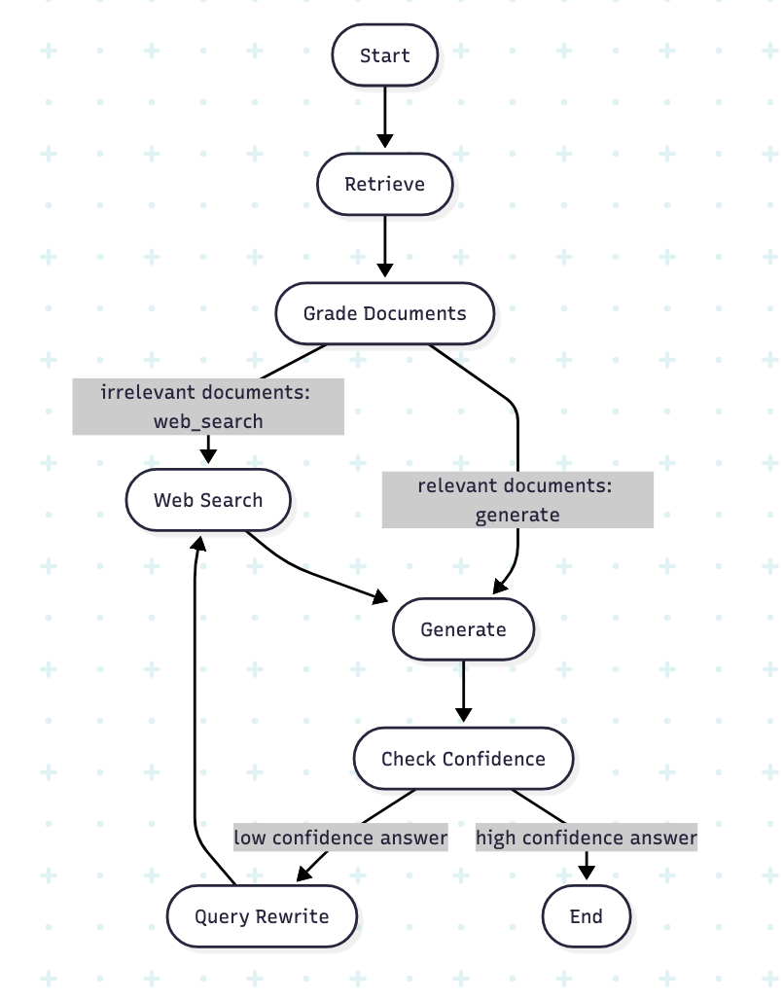
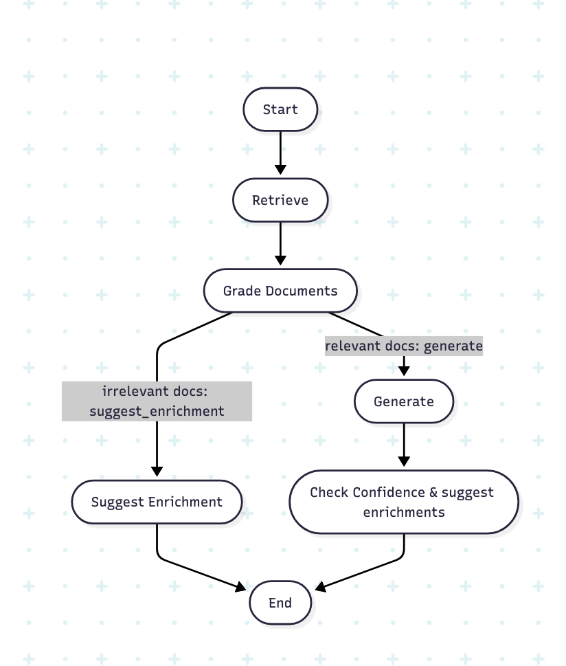

# AI-Powered Knowledge Base

This project provides an intelligent, AI-driven platform for building and querying a knowledge base from your documents. It allows you to upload PDF and text files, and then engage in a conversation to extract insights and answers from the content.

## Key Features

*   **Document Upload:** Easily upload your `.pdf` and `.txt` files to build your knowledge base.
*   **Vectorized Storage:** Documents are automatically parsed, chunked, and stored in a ChromaDB vector database for efficient semantic search.
*   **Advanced RAG Workflows:** Choose from multiple RAG pipelines to suit your needs:
    *   **Suggestion RAG:** If no relevant information is found in your documents, this workflow provides actionable suggestions on what information is missing or how to enrich your knowledge base.
    *   **Web-Search RAG:** When your documents don't have the answer, this workflow can automatically search the web to find the relevant information, providing a more comprehensive response.
*   **Confidence Scoring:** Every answer is returned with a confidence score, giving you insight into the reliability of the information.


## Design Decision

The application is composed of a decoupled backend service that handles the AI logic and a frontend interface for user interaction.

### Backend

The backend is built using **FastAPI** and orchestrates the entire process from document ingestion to answer generation.

1.  **Document Indexing:** When a file is uploaded, the `UploadService` processes it by splitting the content into manageable chunks using a `RecursiveCharacterTextSplitter`. These chunks are then converted into vector embeddings and stored in a **ChromaDB** collection, creating a searchable knowledge base.

2.  **RAG Processing & Workflows:** The `ChatService` selects a RAG workflow based on the user's choice. These workflows, built with **LangGraph**, are state machines that manage the logic of retrieving information and generating answers. The core retrieval process is enhanced with a reranking step:
    *   **Initial Retrieval:** The system performs a vector similarity search in ChromaDB to fetch an initial set of documents that are semantically related to the user's query.
    *   **Reranking:** To improve accuracy, a more powerful **Cross-Encoder model** (`ms-marco-MiniLM-L-6-v2`) re-evaluates the top results from the initial retrieval. Unlike the embedding model, which compares the query and documents independently, the Cross-Encoder examines them together, providing a much more accurate relevance score. This ensures that only the most contextually relevant document chunks are passed to the language model.

3.  **LLM Integration:** The system uses Google's **Gemini** models via the `langchain-google-genai` library to understand the user's query, evaluate document relevance, and generate coherent answers.

4.  **Dynamic Workflows in Detail:**
    *   **SuggestionRAGWorkflow:** This workflow first retrieves and reranks documents. It then uses an LLM call to grade whether the retrieved context is relevant to the question.
        *   If **relevant**, it proceeds to generate an answer, which is then passed to a final "confidence check" node. This node evaluates if the answer is well-supported by the context and generates a confidence score, suggestions, and a list of any missing information.
        *   If **not relevant**, the workflow bypasses answer generation and instead provides actionable suggestions for enriching the knowledge base.
    *   **SearchRAGWorkflow:** This is the most advanced workflow. It follows the same initial steps of retrieval, reranking, and grading.
        *   If the documents are **not relevant**, it triggers a web search using the **Tavily Search API**. The search results are then used as the new context to generate an answer.
        *   After an answer is generated (either from documents or web search), it undergoes a confidence check. If the confidence score is **low**, the workflow determines that the original query might be suboptimal. It then enters a `query_rewrite` step, where the LLM improves the user's question based on the suggestions and missing info. The rewritten query is then used to perform a new web search, and the process repeats to find a better answer.


## Technology Stack

*   **Backend:**
    *   **FastAPI:** Used to create the robust and high-performance backend endpoints.
    *   **LangChain & LangGraph:** Used to create modular and stateful RAG workflows.
    *   **Google Gemini (via `langchain-google-genai`):** The core LLM used for generation, grading, and reasoning.
    *   **ChromaDB:** Used for efficient local vector storage and retrieval.
    *   **Tavily Search:** A search API optimized for LLMs, used to enhance the knowledge base with real-time web results when local documents are insufficient.
*   **Frontend:**
    *   **Streamlit:** Used for rapid development of the interactive web application interface.


### Trade-offs Made During Development

To deliver a functional prototype within the time constraint, the following pragmatic trade-offs were made.

*   **Chunking Strategy:** A generic recursive chunking strategy was used for rapid implementation, which risks splitting content in ways that break semantic meaning.
*   **Workflow Complexity:** LangGraph was chosen for explicit control over complex RAG logic, at the cost of being more verbose and complex than simpler sequential chains.
*   **Answer Completeness Check:** Answer completeness was evaluated via an LLM call for maximum flexibility, introducing extra latency and cost compared to deterministic checks.
* **Default Embedding Model:** For embedding all-MiniLM-L6-v2(384-dimensional vectors) was used for fast, zero-dependency setup, though its general-purpose embeddings may be less precise for specialized documents.
*   **Search Integration:** An external search API (Tavily) was used for quick integration, creating a dependency on a third-party service and its associated costs.
*   **UI and Model Selection:** The UI and underlying LLM model were hardcoded to drastically simplify development, sacrificing user customization and model flexibility.
*   **Query Rephrasing:** Query rewriting was implemented *reactively* after a low-confidence answer to save latency, but it could be rephrased before retreival which can improve document search.
*   **Conversational Context:** Chat history was not used to contextualize new queries to simplify the logic for each turn, which prevents the system from handling conversational follow-ups.
*   **Source Citations:** Source document citations were omitted from the final answer to streamline the generation process, which reduces the transparity of the results.

## Getting Started

To run this application, you will need to start both the backend and the frontend services.

### Prerequisites

*   Python 3.12+
*   **uv**: This project uses `uv` for fast package and virtual environment management. Install it with `pip install uv`.
*   An environment variable for your Google API Key (`GOOGLE_API_KEY`).
*   (Optional) An environment variable for your Tavily API Key (`TAVILY_API_KEY`) for the search-enabled RAG.

### Backend Setup

1.  **Navigate to the backend directory:**
    ```bash
    cd backend
    ```

2.  **Create a virtual environment and install dependencies using uv:**
    ```bash
    uv venv
    uv sync
    ```

3.  **Activate the virtual environment:**
    ```bash
    source .venv/bin/activate  # On Windows use `.venv\Scripts\activate`
    ```

4.  **Create a `.env` file** in the `backend` directory and add your API keys:
    ```
    GOOGLE_API_KEY="YOUR_GOOGLE_API_KEY"
    TAVILY_API_KEY="YOUR_TAVILY_API_KEY"
    ```

5.  **Run the backend server:**
    ```bash
    uv run main.py
    ```
    The backend API will now be available at `http://localhost:8000`.

### Frontend Setup

1.  **Navigate to the frontend directory in a new terminal:**
    ```bash
    cd frontend
    ```

2.  **Create a virtual environment and install dependencies using uv:**
    ```bash
    uv venv
    uv sync
    ```
3.  **Activate the virtual environment:**
    ```bash
    source .venv/bin/activate  # On Windows use `.venv\Scripts\activate`
    ```

4.  **Run the Streamlit application:**
    ```bash
    streamlit run main.py
    ```

The application will open in your web browser. By default, it will connect to the backend at `http://localhost:8000`. You can change this in the "Settings" section of the web interface if your backend is running on a different URL.


### Workflow Graph
**Search RAG **


**Suggestion RAG**

